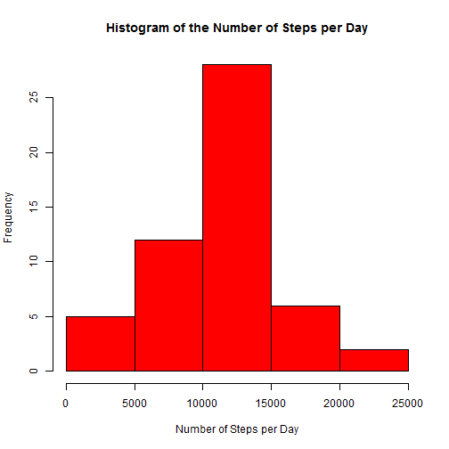
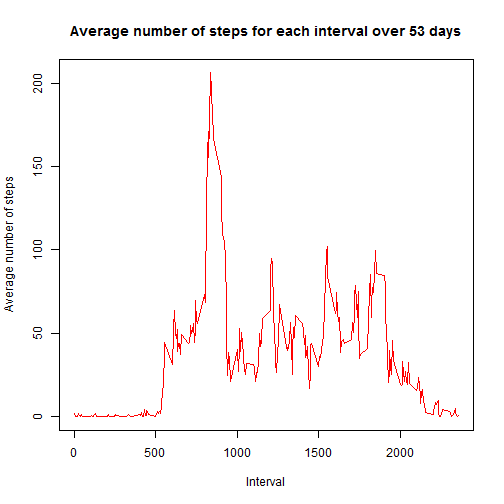
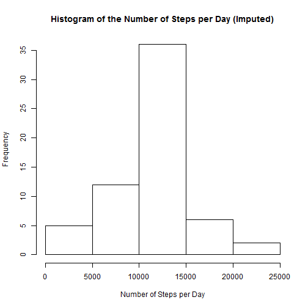

This is my Assignment for Reproducible Research written as a R Markdown file
=========================


1. Code for reading in the dataset and/or processing the data


Set working directory, load some data (Motion data - data downloaded on the 21/03/2017)
Step 1: Download the file (copy from dowload directory to Coursera), Set directory.
Step 2: Unzip the File and make new folder called Movement
Step 3: Read and look at the data format and check there are 3 variables (steps, date and interval) with 17,568 observations.
Step 4: Load the knitr and dplyr packages


```r
setwd("C:/Users/default.TOSHIBA/Desktop/Coursera")
unzip(zipfile="C:/Users/default.TOSHIBA/Desktop/Coursera/repdata_data_activity.zip",exdir="C:/Users/default.TOSHIBA/Desktop/Coursera/Movement")
data <- read.csv("C:/Users/default.TOSHIBA/Desktop/Coursera/Movement/activity.csv",header=T,sep=",", na.strings ="NA") 
summary(data)
```

```
##      steps                date          interval     
##  Min.   :  0.00   2012-10-01:  288   Min.   :   0.0  
##  1st Qu.:  0.00   2012-10-02:  288   1st Qu.: 588.8  
##  Median :  0.00   2012-10-03:  288   Median :1177.5  
##  Mean   : 37.38   2012-10-04:  288   Mean   :1177.5  
##  3rd Qu.: 12.00   2012-10-05:  288   3rd Qu.:1766.2  
##  Max.   :806.00   2012-10-06:  288   Max.   :2355.0  
##  NA's   :2304     (Other)   :15840
```

```r
head(data)
```

```
##   steps       date interval
## 1    NA 2012-10-01        0
## 2    NA 2012-10-01        5
## 3    NA 2012-10-01       10
## 4    NA 2012-10-01       15
## 5    NA 2012-10-01       20
## 6    NA 2012-10-01       25
```

```r
tail(data)
```

```
##       steps       date interval
## 17563    NA 2012-11-30     2330
## 17564    NA 2012-11-30     2335
## 17565    NA 2012-11-30     2340
## 17566    NA 2012-11-30     2345
## 17567    NA 2012-11-30     2350
## 17568    NA 2012-11-30     2355
```

```r
dim(data)
```

```
## [1] 17568     3
```

```r
library(knitr)
library(dplyr)
opts_chunk$set(echo = TRUE)
```
This shows there are 17,568 observationswith NA values in the steps column

We can ignore the missing values in the dataset, as mentioned in assignment blurb. Could also use complete.cases function


```r
data2 <- na.omit(data)
summary(data2)
```

```
##      steps                date          interval     
##  Min.   :  0.00   2012-10-02:  288   Min.   :   0.0  
##  1st Qu.:  0.00   2012-10-03:  288   1st Qu.: 588.8  
##  Median :  0.00   2012-10-04:  288   Median :1177.5  
##  Mean   : 37.38   2012-10-05:  288   Mean   :1177.5  
##  3rd Qu.: 12.00   2012-10-06:  288   3rd Qu.:1766.2  
##  Max.   :806.00   2012-10-07:  288   Max.   :2355.0  
##                   (Other)   :13536
```

```r
head(data2)
```

```
##     steps       date interval
## 289     0 2012-10-02        0
## 290     0 2012-10-02        5
## 291     0 2012-10-02       10
## 292     0 2012-10-02       15
## 293     0 2012-10-02       20
## 294     0 2012-10-02       25
```

```r
tail(data2)
```

```
##       steps       date interval
## 17275     0 2012-11-29     2330
## 17276     0 2012-11-29     2335
## 17277     0 2012-11-29     2340
## 17278     0 2012-11-29     2345
## 17279     0 2012-11-29     2350
## 17280     0 2012-11-29     2355
```

```r
dim(data2)
```

```
## [1] 15264     3
```
Use the function aggregate or group_by to sum the steps per day


```r
stepsperday <- aggregate(steps ~ date, data2, sum)
head(stepsperday,20)
```

```
##          date steps
## 1  2012-10-02   126
## 2  2012-10-03 11352
## 3  2012-10-04 12116
## 4  2012-10-05 13294
## 5  2012-10-06 15420
## 6  2012-10-07 11015
## 7  2012-10-09 12811
## 8  2012-10-10  9900
## 9  2012-10-11 10304
## 10 2012-10-12 17382
## 11 2012-10-13 12426
## 12 2012-10-14 15098
## 13 2012-10-15 10139
## 14 2012-10-16 15084
## 15 2012-10-17 13452
## 16 2012-10-18 10056
## 17 2012-10-19 11829
## 18 2012-10-20 10395
## 19 2012-10-21  8821
## 20 2012-10-22 13460
```

```r
tail(stepsperday,20)
```

```
##          date steps
## 34 2012-11-07 12883
## 35 2012-11-08  3219
## 36 2012-11-11 12608
## 37 2012-11-12 10765
## 38 2012-11-13  7336
## 39 2012-11-15    41
## 40 2012-11-16  5441
## 41 2012-11-17 14339
## 42 2012-11-18 15110
## 43 2012-11-19  8841
## 44 2012-11-20  4472
## 45 2012-11-21 12787
## 46 2012-11-22 20427
## 47 2012-11-23 21194
## 48 2012-11-24 14478
## 49 2012-11-25 11834
## 50 2012-11-26 11162
## 51 2012-11-27 13646
## 52 2012-11-28 10183
## 53 2012-11-29  7047
```

```r
dim(stepsperday)
```

```
## [1] 53  2
```
2. Now plot a Histogram of the number of steps taken each day


```r
hist(stepsperday$steps, col="red", xlab="Number of Steps per Day", main="Histogram of the Number of Steps per Day")
```


3. Calculate the mean and median number of steps taken each day


```r
mean(stepsperday$steps)
```

```
## [1] 10766.19
```

```r
median(stepsperday$steps)
```

```
## [1] 10765
```
This shows the mean is 10766 and the median is 10765 steps

Now calculate the mean number of steps per interval (similar to above)


```r
stepsperinterval <- aggregate(steps ~ interval, data2, mean)
head(stepsperinterval,20)
```

```
##    interval     steps
## 1         0 1.7169811
## 2         5 0.3396226
## 3        10 0.1320755
## 4        15 0.1509434
## 5        20 0.0754717
## 6        25 2.0943396
## 7        30 0.5283019
## 8        35 0.8679245
## 9        40 0.0000000
## 10       45 1.4716981
## 11       50 0.3018868
## 12       55 0.1320755
## 13      100 0.3207547
## 14      105 0.6792453
## 15      110 0.1509434
## 16      115 0.3396226
## 17      120 0.0000000
## 18      125 1.1132075
## 19      130 1.8301887
## 20      135 0.1698113
```

```r
tail(stepsperinterval,20)
```

```
##     interval     steps
## 269     2220 7.0754717
## 270     2225 8.6981132
## 271     2230 9.7547170
## 272     2235 2.2075472
## 273     2240 0.3207547
## 274     2245 0.1132075
## 275     2250 1.6037736
## 276     2255 4.6037736
## 277     2300 3.3018868
## 278     2305 2.8490566
## 279     2310 0.0000000
## 280     2315 0.8301887
## 281     2320 0.9622642
## 282     2325 1.5849057
## 283     2330 2.6037736
## 284     2335 4.6981132
## 285     2340 3.3018868
## 286     2345 0.6415094
## 287     2350 0.2264151
## 288     2355 1.0754717
```

```r
dim(stepsperinterval)
```

```
## [1] 288   2
```

```r
stepsperinterval
```

```
##     interval       steps
## 1          0   1.7169811
## 2          5   0.3396226
## 3         10   0.1320755
## 4         15   0.1509434
## 5         20   0.0754717
## 6         25   2.0943396
## 7         30   0.5283019
## 8         35   0.8679245
## 9         40   0.0000000
## 10        45   1.4716981
## 11        50   0.3018868
## 12        55   0.1320755
## 13       100   0.3207547
## 14       105   0.6792453
## 15       110   0.1509434
## 16       115   0.3396226
## 17       120   0.0000000
## 18       125   1.1132075
## 19       130   1.8301887
## 20       135   0.1698113
## 21       140   0.1698113
## 22       145   0.3773585
## 23       150   0.2641509
## 24       155   0.0000000
## 25       200   0.0000000
## 26       205   0.0000000
## 27       210   1.1320755
## 28       215   0.0000000
## 29       220   0.0000000
## 30       225   0.1320755
## 31       230   0.0000000
## 32       235   0.2264151
## 33       240   0.0000000
## 34       245   0.0000000
## 35       250   1.5471698
## 36       255   0.9433962
## 37       300   0.0000000
## 38       305   0.0000000
## 39       310   0.0000000
## 40       315   0.0000000
## 41       320   0.2075472
## 42       325   0.6226415
## 43       330   1.6226415
## 44       335   0.5849057
## 45       340   0.4905660
## 46       345   0.0754717
## 47       350   0.0000000
## 48       355   0.0000000
## 49       400   1.1886792
## 50       405   0.9433962
## 51       410   2.5660377
## 52       415   0.0000000
## 53       420   0.3396226
## 54       425   0.3584906
## 55       430   4.1132075
## 56       435   0.6603774
## 57       440   3.4905660
## 58       445   0.8301887
## 59       450   3.1132075
## 60       455   1.1132075
## 61       500   0.0000000
## 62       505   1.5660377
## 63       510   3.0000000
## 64       515   2.2452830
## 65       520   3.3207547
## 66       525   2.9622642
## 67       530   2.0943396
## 68       535   6.0566038
## 69       540  16.0188679
## 70       545  18.3396226
## 71       550  39.4528302
## 72       555  44.4905660
## 73       600  31.4905660
## 74       605  49.2641509
## 75       610  53.7735849
## 76       615  63.4528302
## 77       620  49.9622642
## 78       625  47.0754717
## 79       630  52.1509434
## 80       635  39.3396226
## 81       640  44.0188679
## 82       645  44.1698113
## 83       650  37.3584906
## 84       655  49.0377358
## 85       700  43.8113208
## 86       705  44.3773585
## 87       710  50.5094340
## 88       715  54.5094340
## 89       720  49.9245283
## 90       725  50.9811321
## 91       730  55.6792453
## 92       735  44.3207547
## 93       740  52.2641509
## 94       745  69.5471698
## 95       750  57.8490566
## 96       755  56.1509434
## 97       800  73.3773585
## 98       805  68.2075472
## 99       810 129.4339623
## 100      815 157.5283019
## 101      820 171.1509434
## 102      825 155.3962264
## 103      830 177.3018868
## 104      835 206.1698113
## 105      840 195.9245283
## 106      845 179.5660377
## 107      850 183.3962264
## 108      855 167.0188679
## 109      900 143.4528302
## 110      905 124.0377358
## 111      910 109.1132075
## 112      915 108.1132075
## 113      920 103.7169811
## 114      925  95.9622642
## 115      930  66.2075472
## 116      935  45.2264151
## 117      940  24.7924528
## 118      945  38.7547170
## 119      950  34.9811321
## 120      955  21.0566038
## 121     1000  40.5660377
## 122     1005  26.9811321
## 123     1010  42.4150943
## 124     1015  52.6603774
## 125     1020  38.9245283
## 126     1025  50.7924528
## 127     1030  44.2830189
## 128     1035  37.4150943
## 129     1040  34.6981132
## 130     1045  28.3396226
## 131     1050  25.0943396
## 132     1055  31.9433962
## 133     1100  31.3584906
## 134     1105  29.6792453
## 135     1110  21.3207547
## 136     1115  25.5471698
## 137     1120  28.3773585
## 138     1125  26.4716981
## 139     1130  33.4339623
## 140     1135  49.9811321
## 141     1140  42.0377358
## 142     1145  44.6037736
## 143     1150  46.0377358
## 144     1155  59.1886792
## 145     1200  63.8679245
## 146     1205  87.6981132
## 147     1210  94.8490566
## 148     1215  92.7735849
## 149     1220  63.3962264
## 150     1225  50.1698113
## 151     1230  54.4716981
## 152     1235  32.4150943
## 153     1240  26.5283019
## 154     1245  37.7358491
## 155     1250  45.0566038
## 156     1255  67.2830189
## 157     1300  42.3396226
## 158     1305  39.8867925
## 159     1310  43.2641509
## 160     1315  40.9811321
## 161     1320  46.2452830
## 162     1325  56.4339623
## 163     1330  42.7547170
## 164     1335  25.1320755
## 165     1340  39.9622642
## 166     1345  53.5471698
## 167     1350  47.3207547
## 168     1355  60.8113208
## 169     1400  55.7547170
## 170     1405  51.9622642
## 171     1410  43.5849057
## 172     1415  48.6981132
## 173     1420  35.4716981
## 174     1425  37.5471698
## 175     1430  41.8490566
## 176     1435  27.5094340
## 177     1440  17.1132075
## 178     1445  26.0754717
## 179     1450  43.6226415
## 180     1455  43.7735849
## 181     1500  30.0188679
## 182     1505  36.0754717
## 183     1510  35.4905660
## 184     1515  38.8490566
## 185     1520  45.9622642
## 186     1525  47.7547170
## 187     1530  48.1320755
## 188     1535  65.3207547
## 189     1540  82.9056604
## 190     1545  98.6603774
## 191     1550 102.1132075
## 192     1555  83.9622642
## 193     1600  62.1320755
## 194     1605  64.1320755
## 195     1610  74.5471698
## 196     1615  63.1698113
## 197     1620  56.9056604
## 198     1625  59.7735849
## 199     1630  43.8679245
## 200     1635  38.5660377
## 201     1640  44.6603774
## 202     1645  45.4528302
## 203     1650  46.2075472
## 204     1655  43.6792453
## 205     1700  46.6226415
## 206     1705  56.3018868
## 207     1710  50.7169811
## 208     1715  61.2264151
## 209     1720  72.7169811
## 210     1725  78.9433962
## 211     1730  68.9433962
## 212     1735  59.6603774
## 213     1740  75.0943396
## 214     1745  56.5094340
## 215     1750  34.7735849
## 216     1755  37.4528302
## 217     1800  40.6792453
## 218     1805  58.0188679
## 219     1810  74.6981132
## 220     1815  85.3207547
## 221     1820  59.2641509
## 222     1825  67.7735849
## 223     1830  77.6981132
## 224     1835  74.2452830
## 225     1840  85.3396226
## 226     1845  99.4528302
## 227     1850  86.5849057
## 228     1855  85.6037736
## 229     1900  84.8679245
## 230     1905  77.8301887
## 231     1910  58.0377358
## 232     1915  53.3584906
## 233     1920  36.3207547
## 234     1925  20.7169811
## 235     1930  27.3962264
## 236     1935  40.0188679
## 237     1940  30.2075472
## 238     1945  25.5471698
## 239     1950  45.6603774
## 240     1955  33.5283019
## 241     2000  19.6226415
## 242     2005  19.0188679
## 243     2010  19.3396226
## 244     2015  33.3396226
## 245     2020  26.8113208
## 246     2025  21.1698113
## 247     2030  27.3018868
## 248     2035  21.3396226
## 249     2040  19.5471698
## 250     2045  21.3207547
## 251     2050  32.3018868
## 252     2055  20.1509434
## 253     2100  15.9433962
## 254     2105  17.2264151
## 255     2110  23.4528302
## 256     2115  19.2452830
## 257     2120  12.4528302
## 258     2125   8.0188679
## 259     2130  14.6603774
## 260     2135  16.3018868
## 261     2140   8.6792453
## 262     2145   7.7924528
## 263     2150   8.1320755
## 264     2155   2.6226415
## 265     2200   1.4528302
## 266     2205   3.6792453
## 267     2210   4.8113208
## 268     2215   8.5094340
## 269     2220   7.0754717
## 270     2225   8.6981132
## 271     2230   9.7547170
## 272     2235   2.2075472
## 273     2240   0.3207547
## 274     2245   0.1132075
## 275     2250   1.6037736
## 276     2255   4.6037736
## 277     2300   3.3018868
## 278     2305   2.8490566
## 279     2310   0.0000000
## 280     2315   0.8301887
## 281     2320   0.9622642
## 282     2325   1.5849057
## 283     2330   2.6037736
## 284     2335   4.6981132
## 285     2340   3.3018868
## 286     2345   0.6415094
## 287     2350   0.2264151
## 288     2355   1.0754717
```
4. Plot a time series of the average number of steps taken per interval for all days


```r
plot(stepsperinterval$interval, stepsperinterval$steps, type='l', col="red", 
     main="Average number of steps for each interval over 53 days", xlab="Interval", 
     ylab="Average number of steps")
```



5. Find the 5-minute interval that, on average, contains the maximum number of steps


```r
maxstepsinterval <- which.max(stepsperinterval$steps)
stepsperinterval[maxstepsinterval,]
```

```
##     interval    steps
## 104      835 206.1698
```
So the interval 835 has the maxiumum number of 206 steps

6. Code to describe and show a strategy for imputing missing data
The number of missing values (NAs)


```r
sum(is.na(data))
```

```
## [1] 2304
```
The total number of rows with Nas is 2304

Fill in missing data values----use the mean for that 5-minute interval
Create new dataset 
Loop through the rows of data, find the NA in steps and corresponding interval, 
Identify the mean number of steps for that interval and replace the NA value with the mean value

```r
for (i in 1:nrow(data)) {
    if(is.na(data$steps[i])) {
        newdata <- stepsperinterval$steps[which(stepsperinterval$interval == data$interval[i])]
        data$steps[i] <- newdata 
    }
}
```

7. Now sum up the total number of steps per day and plot histogram after missing values are imputed

```r
stepsperdayimpute <- aggregate(steps ~ date, data, sum)
head(stepsperdayimpute)
```

```
##         date    steps
## 1 2012-10-01 10766.19
## 2 2012-10-02   126.00
## 3 2012-10-03 11352.00
## 4 2012-10-04 12116.00
## 5 2012-10-05 13294.00
## 6 2012-10-06 15420.00
```

```r
hist(stepsperdayimpute$steps, xlab = "Number of Steps per Day", main = "Histogram of the Number of Steps per Day (Imputed)")
```


Calculate the mean and median number of steps


```r
mean(stepsperdayimpute$steps)
```

```
## [1] 10766.19
```

```r
median(stepsperdayimpute$steps)
```

```
## [1] 10766.19
```
The mean is 10766 and the median is 10766. The values have not changed significantly as expected

8. Make a Panel plot comparing the average number of steps taken per 5-minute interval across weekdays and weekends
Use the weekday() function and the dataset with the filled-in missing values first.


```r
data['typeofday'] <- weekdays(as.Date(data$date))
data$typeofday[data$typeofday  %in% c('Saturday','Sunday') ] <- "weekend"
data$typeofday[data$typeofday != "weekend"] <- "weekday"
head(data,20)
```

```
##        steps       date interval typeofday
## 1  1.7169811 2012-10-01        0   weekday
## 2  0.3396226 2012-10-01        5   weekday
## 3  0.1320755 2012-10-01       10   weekday
## 4  0.1509434 2012-10-01       15   weekday
## 5  0.0754717 2012-10-01       20   weekday
## 6  2.0943396 2012-10-01       25   weekday
## 7  0.5283019 2012-10-01       30   weekday
## 8  0.8679245 2012-10-01       35   weekday
## 9  0.0000000 2012-10-01       40   weekday
## 10 1.4716981 2012-10-01       45   weekday
## 11 0.3018868 2012-10-01       50   weekday
## 12 0.1320755 2012-10-01       55   weekday
## 13 0.3207547 2012-10-01      100   weekday
## 14 0.6792453 2012-10-01      105   weekday
## 15 0.1509434 2012-10-01      110   weekday
## 16 0.3396226 2012-10-01      115   weekday
## 17 0.0000000 2012-10-01      120   weekday
## 18 1.1132075 2012-10-01      125   weekday
## 19 1.8301887 2012-10-01      130   weekday
## 20 0.1698113 2012-10-01      135   weekday
```

```r
tail(data,60)
```

```
##            steps       date interval typeofday
## 17509 84.8679245 2012-11-30     1900   weekday
## 17510 77.8301887 2012-11-30     1905   weekday
## 17511 58.0377358 2012-11-30     1910   weekday
## 17512 53.3584906 2012-11-30     1915   weekday
## 17513 36.3207547 2012-11-30     1920   weekday
## 17514 20.7169811 2012-11-30     1925   weekday
## 17515 27.3962264 2012-11-30     1930   weekday
## 17516 40.0188679 2012-11-30     1935   weekday
## 17517 30.2075472 2012-11-30     1940   weekday
## 17518 25.5471698 2012-11-30     1945   weekday
## 17519 45.6603774 2012-11-30     1950   weekday
## 17520 33.5283019 2012-11-30     1955   weekday
## 17521 19.6226415 2012-11-30     2000   weekday
## 17522 19.0188679 2012-11-30     2005   weekday
## 17523 19.3396226 2012-11-30     2010   weekday
## 17524 33.3396226 2012-11-30     2015   weekday
## 17525 26.8113208 2012-11-30     2020   weekday
## 17526 21.1698113 2012-11-30     2025   weekday
## 17527 27.3018868 2012-11-30     2030   weekday
## 17528 21.3396226 2012-11-30     2035   weekday
## 17529 19.5471698 2012-11-30     2040   weekday
## 17530 21.3207547 2012-11-30     2045   weekday
## 17531 32.3018868 2012-11-30     2050   weekday
## 17532 20.1509434 2012-11-30     2055   weekday
## 17533 15.9433962 2012-11-30     2100   weekday
## 17534 17.2264151 2012-11-30     2105   weekday
## 17535 23.4528302 2012-11-30     2110   weekday
## 17536 19.2452830 2012-11-30     2115   weekday
## 17537 12.4528302 2012-11-30     2120   weekday
## 17538  8.0188679 2012-11-30     2125   weekday
## 17539 14.6603774 2012-11-30     2130   weekday
## 17540 16.3018868 2012-11-30     2135   weekday
## 17541  8.6792453 2012-11-30     2140   weekday
## 17542  7.7924528 2012-11-30     2145   weekday
## 17543  8.1320755 2012-11-30     2150   weekday
## 17544  2.6226415 2012-11-30     2155   weekday
## 17545  1.4528302 2012-11-30     2200   weekday
## 17546  3.6792453 2012-11-30     2205   weekday
## 17547  4.8113208 2012-11-30     2210   weekday
## 17548  8.5094340 2012-11-30     2215   weekday
## 17549  7.0754717 2012-11-30     2220   weekday
## 17550  8.6981132 2012-11-30     2225   weekday
## 17551  9.7547170 2012-11-30     2230   weekday
## 17552  2.2075472 2012-11-30     2235   weekday
## 17553  0.3207547 2012-11-30     2240   weekday
## 17554  0.1132075 2012-11-30     2245   weekday
## 17555  1.6037736 2012-11-30     2250   weekday
## 17556  4.6037736 2012-11-30     2255   weekday
## 17557  3.3018868 2012-11-30     2300   weekday
## 17558  2.8490566 2012-11-30     2305   weekday
## 17559  0.0000000 2012-11-30     2310   weekday
## 17560  0.8301887 2012-11-30     2315   weekday
## 17561  0.9622642 2012-11-30     2320   weekday
## 17562  1.5849057 2012-11-30     2325   weekday
## 17563  2.6037736 2012-11-30     2330   weekday
## 17564  4.6981132 2012-11-30     2335   weekday
## 17565  3.3018868 2012-11-30     2340   weekday
## 17566  0.6415094 2012-11-30     2345   weekday
## 17567  0.2264151 2012-11-30     2350   weekday
## 17568  1.0754717 2012-11-30     2355   weekday
```

```r
data$typeofday <- as.factor(data$typeofday)
dataImputestepsbyinterval <- aggregate(steps ~ interval + typeofday, data, mean)
```
8. Panel plot comparing the average number of steps taken per 5-minute interval across weekdays and weekends


```r
library(ggplot2)
qplot(interval, steps, data=dataImputestepsbyinterval, geom=c("line"), xlab="Interval", 
      ylab="Number of steps", main="") + facet_wrap(~ typeofday, ncol=1)
```


9. All of the R code needed to reproduce the results (numbers, plots, etc.) in the report


